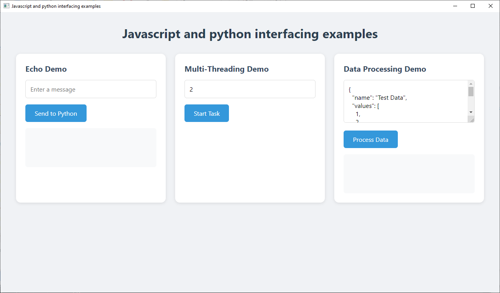
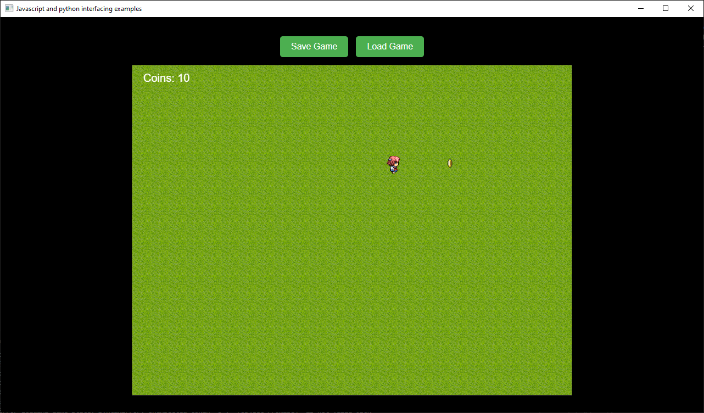

# Javascript-and-python-interfacing-examples
Examples of interfacing between javascript and python for desktop apps and games without requiring a localhost server component.

You can achieve the same functionality as [eel](https://github.com/python-eel/Eel) by using PyQt6's QWebEngineView in combination with QWebChannel to create a bridge between Python and JavaScript.\
This allows you to embed an HTML/JS frontend inside a PyQt6-based desktop app and call Python functions from JavaScript (and vice versa).

# How This Works:
**QWebEngineView:** A browser component inside PyQt6 that can render HTML, CSS, and JavaScript.\
  pip install PyQt6-WebEngine\
**QWebChannel:** A communication bridge that lets JavaScript call Python functions directly.\
  qwebchannel.js is available [here](https://github.com/qt/qtwebchannel/blob/dev/examples/webchannel/shared/qwebchannel.js)\
**Python acts as the backend**, while **HTML/JavaScript provide the frontend**.

# Examples:

**main.py** will load **multi-threading_demo.html** by default.\
To try the other demos, simply replace that line 160 in main.py with the name of the desired demo file you wish to see.

## multi-threading_demo.html

1. Echo Demo
    - takes the input and sends it to python then back to javascript
2. Multi-Threading Demo
    - each click creates a task that runs for the input number of seconds in parallel with other running tasks
3. Data Processing Demo
    - takes the input and send it to python where it is validated or denied then sent back to javascript

## game_demo.html (pixel.js game)

Uses the pixel.js coin collector game demo, with added save/load game state functionality.\
Demonstrates how to use the qwebchannel bridge to send save/load messages and data to python for processing.

*The assets are from the pixel.js coin collector demo (https://github.com/rastating/pixel.js)*

